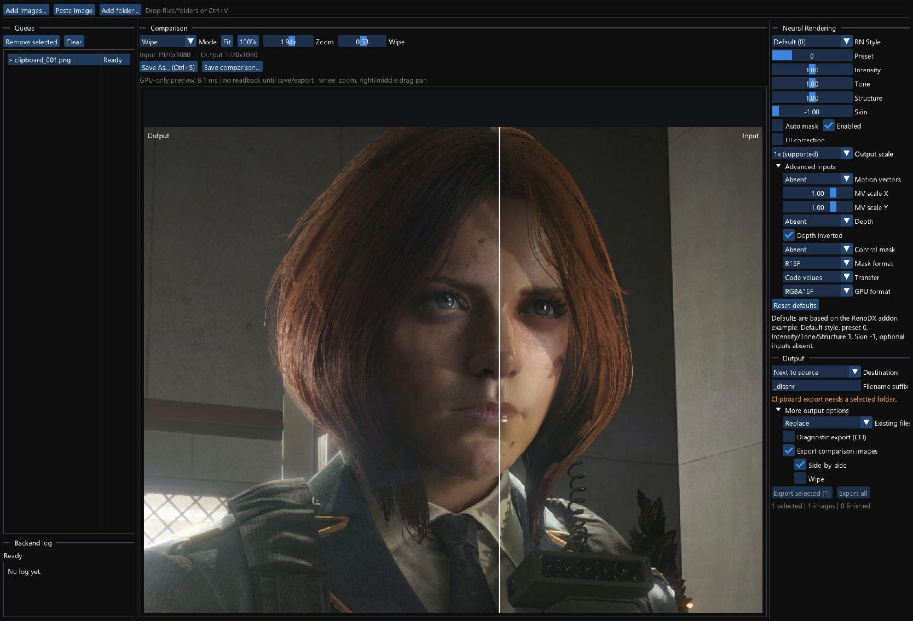

# dlss5-nr-media-poc

A Windows/D3D12 PoC that applies NVIDIA DLSS 5 Neural Rendering
(`nvngx_dlssnr.dll`) to static PNG/JPEG images.

Images are decoded with WIC, uploaded to D3D12 textures, passed to the NGX
feature, and displayed directly from its output GPU texture. In the GUI,
parameter changes are applied in real time, results can be compared using wipe,
side-by-side, or difference views, and processed or comparison images can be
saved individually or exported in batches. The CLI provides the same processing
controls for automation, with optional baseline and difference images, metrics,
and diagnostic logs.



NVIDIA binaries and SDK headers are not included. Runtime requires 64-bit
Windows, D3D12, an NVIDIA display driver with NGX, and a user-provided
`nvngx_dlssnr.dll`.

## Run

Unpack the release and use this layout:

```text
dlss5-nr-media-poc/
  dlssnr-gui.exe
  dlssnr-image.exe
  nvngx_dlssnr.dll       supplied by the user
  caller/
    nvngx.dll            included; built from this repository
```

Launch `dlssnr-gui.exe`. Add files/folders, drag and drop, or paste an image
with `Ctrl+V`. The GUI supports live parameter changes, wipe/side-by-side/
difference comparison, explicit save, and batch export.

CLI, output only:

```powershell
.\dlssnr-image.exe input.png output.png --diagnostics 0
```

CLI with baseline, difference, metrics, and log:

```powershell
.\dlssnr-image.exe input.png output.png --diagnostics 1
```

Run `dlssnr-image.exe` without arguments to see all controls.

## Tested NVIDIA versions

| Component | Version used |
|---|---|
| Display driver | `616.56` (`32.0.16.1656`) |
| Driver NGX core `_nvngx.dll` | `32.0.16.1656` |
| `nvngx_dlssnr.dll` | `310.8.0.0` |
| Official NVIDIA/DLSS headers | `v310.7.0`, commit `a291cc7d2cc642a51566f3dfd5376f635cd1b284` |
| NGX API from those headers | `1.5.0` / `0x15` |

Those are the versions used for the current builds and tests. Other versions
may work, but have not been checked.

## Build

Requires Visual Studio 2022 C++, a Windows SDK, CMake 3.24+, official NVIDIA
DLSS/NGX headers, and the ImGui submodule.

Use a Git clone; GitHub's generated source ZIP does not include submodules.

```powershell
git submodule update --init --depth 1
git clone --branch v310.7.0 --depth 1 https://github.com/NVIDIA/DLSS.git .cache\NVIDIA-DLSS
.\build.cmd .cache\NVIDIA-DLSS
```

Build output is under `build/Release`. To create the release layout:

```powershell
cmake --install build --config Release --prefix dist\dlss5-nr-media-poc
```

NVIDIA libraries are loaded dynamically; no NVIDIA import/static library is
linked. Release builds use `/MT`, so the Visual C++ Redistributable is not
required.

## Current limits

- Working output is 1:1. The experimental 2x path currently fails at Evaluate.
- Still images only; video is not implemented.
- PNG/JPEG input through Windows Imaging Component.
- Motion-vector, depth, HDR, and optional game-buffer conventions are not fully known.

## License

Project code is MIT licensed. Dear ImGui keeps its own MIT license; see
[THIRD_PARTY_NOTICES.md](THIRD_PARTY_NOTICES.md).

This project is unofficial and is not affiliated with or endorsed by NVIDIA.
It does not modify or redistribute NVIDIA software. Users must provide a
compatible NVIDIA DLL themselves and must have the right to use it.
